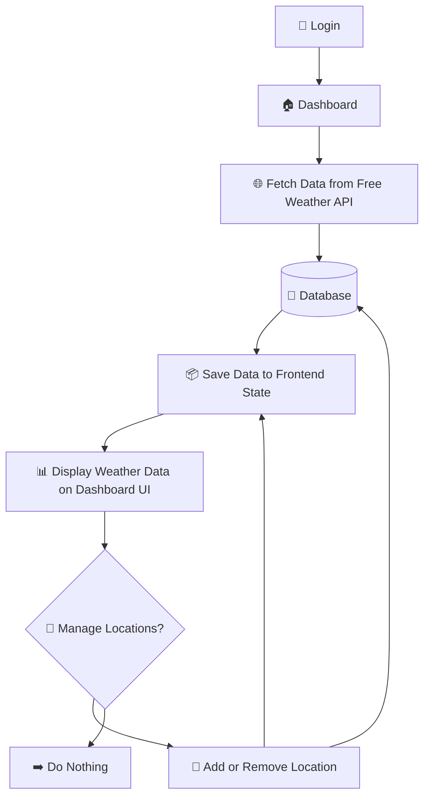

## Frontend Weatherly

แดชบอร์ดอากาศ (App Router) + Tailwind CSS + Zustand + NextAuth
กราฟจาก Chart.js
แผนที่ Leaflet

## คุณสมบัติหลัก
- 📊 Dashboard, Locations, Compare (multi-page) ผูกกับ Zustand store
- 🔐 NextAuth (credentials) mock login + token refresh helper
- 🌗 Theme toggle ด้วย `next-themes` รองรับ system preference
- 🌤️ กราฟสภาพอากาศ (Hourly/Daily) ผ่าน react-chartjs-2
- 🗺️ เลือกพิกัดเมืองด้วย Leaflet (MapPicker)
- 💾 IndexedDB caching + offline fallback (lib/db.ts + lib/weather.ts)
- 🔁 API `/api/locations` ให้ mock city data + follow/unfollow/delete

## โครงสร้างสำคัญหลักๆ
```
app/
  (site)/dashboard/page.tsx    # หน้า Overview
  (site)/locations/page.tsx    # จัดการเมือง + compare mode
  (site)/compare/page.tsx      # เปรียบเทียบ 2 เมือง
components/
  WeatherCard.tsx
  WeatherHourlyChart.tsx
  WeatherDailyChart.tsx
  CitySearchInput.tsx
  MapPicker.tsx
  Header.tsx / Footer.tsx
lib/
  weather.ts / fetcher.ts / locations.ts
  mockWeather.ts              # สร้าง hourly/daily mock
store/
  locationStore.ts            # Zustand state + actions
utils/
  auth.ts / themeProviders.ts
```

## Getting Started

First, run the development server:

```bash
npm run dev
# or
yarn dev
# or
pnpm dev
# or
bun dev
```

Open [http://localhost:3000](http://localhost:3000) with your browser to see the result.

You can start editing the page by modifying `app/page.tsx`. The page auto-updates as you edit the file.

This project uses [`next/font`](https://nextjs.org/docs/app/building-your-application/optimizing/fonts) to automatically optimize and load [Geist](https://vercel.com/font), a new font family for Vercel.

## Learn More

To learn more about Next.js, take a look at the following resources:

- [Next.js Documentation](https://nextjs.org/docs) - learn about Next.js features and API.
- [Learn Next.js](https://nextjs.org/learn) - an interactive Next.js tutorial.

You can check out [the Next.js GitHub repository](https://github.com/vercel/next.js) - your feedback and contributions are welcome!


## 🌦️ Weather Dashboard Flow


##
