## Frontend Weatherly

This is a [Next.js](https://nextjs.org) project bootstrapped with [`create-next-app`](https://nextjs.org/docs/app/api-reference/cli/create-next-app).

## Getting Started

First, run the development server:

```bash
npm run dev
# or
yarn dev
# or
pnpm dev
# or
bun dev
```

Open [http://localhost:3000](http://localhost:3000) with your browser to see the result.

You can start editing the page by modifying `app/page.tsx`. The page auto-updates as you edit the file.

This project uses [`next/font`](https://nextjs.org/docs/app/building-your-application/optimizing/fonts) to automatically optimize and load [Geist](https://vercel.com/font), a new font family for Vercel.

## Learn More

To learn more about Next.js, take a look at the following resources:

- [Next.js Documentation](https://nextjs.org/docs) - learn about Next.js features and API.
- [Learn Next.js](https://nextjs.org/learn) - an interactive Next.js tutorial.

You can check out [the Next.js GitHub repository](https://github.com/vercel/next.js) - your feedback and contributions are welcome!


## 🌦️ Weather Dashboard Flow

```mermaid
flowchart TD
    A[👤 Login] --> B[🏠 Dashboard]
    B --> C[🌐 Fetch Data from Free Weather API]
    C --> D[(💾 Database)]
    D --> S[📦 Save Data to Frontend State]
    S --> E[📊 Display Weather Data on Dashboard UI]

    E --> F{🧭 Manage Locations?}
    F --> G[📍 Add or Remove Location]
    F --> H[➡️ Do Nothing]

    G --> D
    G --> S
    
```


##
